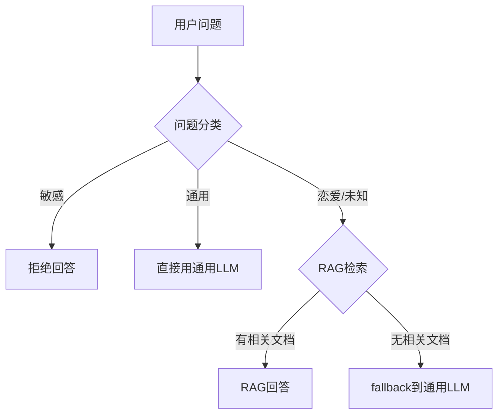

# RAG Fallback 方案实现文档

## 一、背景与需求

### 1.1 原有问题

在之前的实现中，当用户提问时，系统会通过RAG（检索增强生成）从知识库中检索相关信息来回答问题。具体流程如下：

```
用户问题 → RAG检索 → 相似度判断(阈值0.6) → 有结果→ RAG回答
                                              ↓无结果
                                         返回默认提示"抱歉，我只能回答恋爱相关的问题..."
```

**问题**：当用户提问的是通用问题（如天气、新闻、历史等）或者知识库中没有相关内容时，系统只能返回固定的拒绝提示，无法利用LLM自身的通用知识来回答。

### 1.2 需求目标

- **通用问题**：用户问天气、新闻、历史等问题时，希望AI能用通用知识回答
- **知识库缺失**：当恋爱相关问题在知识库中没有匹配时，fallback到通用LLM回答
- **敏感内容**：对于违法准则的内容，仍然拒绝回答

---

## 二、方案设计

### 2.1 核心思路：两阶段调用策略



### 2.2 问题分类逻辑

| 类型 | 判断依据 | 处理方式 |
|------|----------|----------|
| **SENSITIVE** | 包含敏感词（暴力、色情、赌博、毒品、政治等） | 返回拒绝回答 |
| **GENERAL** | 包含通用关键词（天气、新闻、历史、科技、生活等） | 直接用通用LLM回答 |
| **LOVE_RELATED** | 包含恋爱关键词（恋爱、感情、表白、约会等） | 尝试RAG检索 |
| **UNKNOWN** | 无法识别 | 尝试RAG检索 |

### 2.3 RAG Fallback 机制

```java
// 核心逻辑
1. 先进行RAG检索（不经过LLM生成）
2. 检查检索结果的相似度分数
3. 如果最高分数 >= 0.6 → 使用RAG回答
4. 如果最高分数 < 0.6 → fallback到通用LLM回答
```

**为什么要先检索再判断？**
- 避免不必要的LLM调用开销
- 提前判断是否有相关知识，决策更精准
- 0.6的阈值是经验值，平衡了召回率和准确率

---

## 三、代码实现

### 3.1 新增文件

**QuestionClassifierService.java**
- 问题分类服务
- 敏感词检测（12+敏感类别）
- 恋爱关键词检测（30+恋爱相关词）
- 通用问题关键词检测（40+类别）

### 3.2 修改文件

**LoveApp.java**
- 新增 `doChatWithRagFallback()` - 对话入口
- 新增 `doChatWithRagOrFallback()` - RAG fallback核心逻辑

**AiController.java**
- 新增 `/ai/love_app/chat/rag_fallback` 端点

---

## 四、为什么这样设计

### 4.1 为什么不直接让LLM判断问题类型？

**原因**：
1. **性能**：正则匹配比LLM调用快得多，成本更低
2. **确定性**：敏感词检测需要100%准确，不适合LLM判断
3. **简单有效**：关键词匹配对于大多数场景已经足够

### 4.2 为什么要分离通用问题和恋爱问题？

**原因**：
1. **专业定位**：这是一个"AI恋爱大师"应用，主要服务恋爱领域
2. **知识库效率**：恋爱问题优先从专业知识库获取答案，更准确
3. **用户体验**：通用问题直接回答，不至于让用户感觉"答非所问"

### 4.3 为什么要用0.6作为阈值？

**原因**：
- Spring AI的相似度分数是距离度量（越小越相似）
- 但在向量存储中，分数通常被转换为相似度（0-1，1表示完全相同）
- 0.6是一个经验值，平衡了：
  - **召回率**：不会漏掉相关文档
  - **准确率**：不会引入太多无关文档

### 4.4 为什么通用问题不经过RAG？

**原因**：
1. 知识库内容主要是恋爱相关的，检索通用问题可能匹配到无关内容
2. 通用问题用LLM自身知识回答效果更好
3. 减少不必要的检索开销

---

## 五、使用方式

### 5.1 API调用

```
GET /api/ai/love_app/chat/rag_fallback?message=今天天气怎么样&chatId=123

GET /api/ai/love_app/chat/rag_fallback?message=如何追女生&chatId=123
```

### 5.2 测试场景

| 测试输入 | 预期输出 |
|----------|----------|
| "今天天气怎么样" | 通用LLM回答天气信息 |
| "帮我查下北京的历史" | 通用LLM回答历史知识 |
| "如何追喜欢的女生" | RAG知识库回答（或fallback） |
| "有什么好看的电影" | fallback到通用LLM |
| [敏感内容] | 返回拒绝提示 |

---

## 六、扩展建议

### 6.1 可配置的敏感词库

后续可以通过配置文件或数据库动态管理敏感词，适应不同业务需求。

### 6.2 多知识库支持

可以扩展为：
- 恋爱知识库 → 恋爱问题
- 通用知识库 → 通用问题
- 其他专业领域 → 专业问题

### 6.3 阈值可配置

将0.6的阈值提取为配置项，允许根据知识库质量动态调整。

---

## 七、总结

本方案的核心价值：

1. **扩展能力**：从只能回答恋爱问题 → 也能回答通用问题
2. **用户体验**：知识库没有答案时，不返回冷冰冰的拒绝，而是给出有价值的回答
3. **技术简单**：利用现有RAG基础设施，增加少量代码即可实现
4. **安全可控**：敏感内容仍然会被过滤
