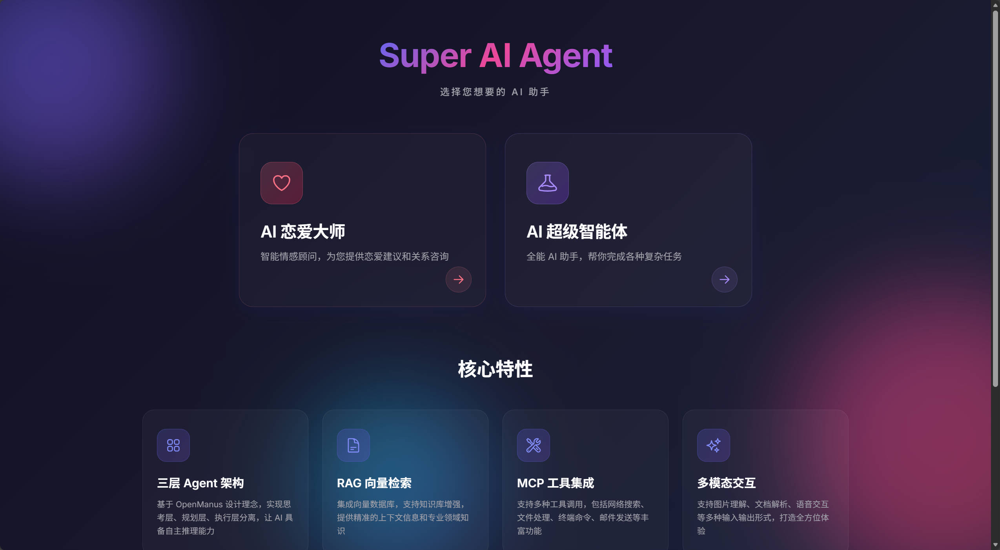
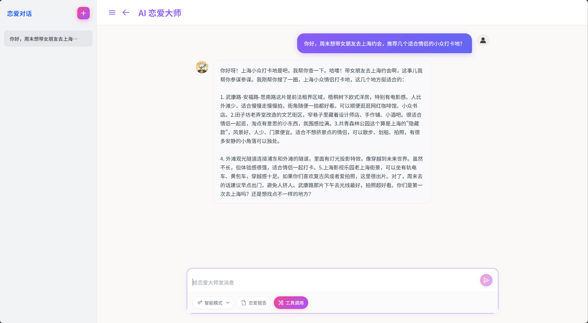
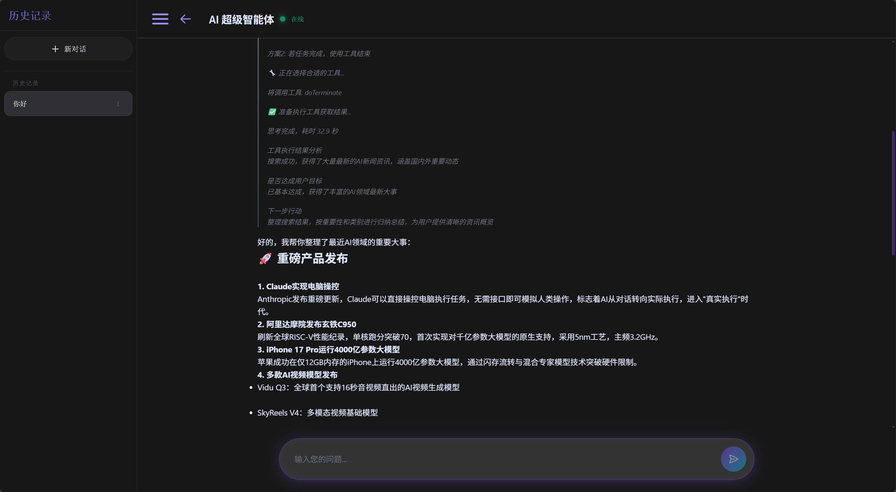

# Super AI Agent - 智能对话助手平台

<div align="center">

中文 | [English](README.md)


基于 Spring Boot 3.5 + Java 21 + Spring AI + Vue 3，实现 AI 情感咨询、深度思考智能体、RAG 知识库检索、多工具调用等核心功能。支持恋爱报告生成、地图服务集成、PDF 文档处理等实用场景。架构清晰、文档完善，非常适合作为 AI 应用学习和简历项目，学习门槛低。

[功能特性](#功能特性) • [技术架构](#技术架构) • [快速开始](#快速开始) • [演示效果](#演示效果)

</div>

---

## 📸 演示效果

### 首页

<p align="center">
  
  <br/>
  <em>首页 - 选择你的AI助手</em>
</p>

**功能展示：**

- ✅ 简洁现代的界面设计
- ✅ 两大AI应用可供选择
- ✅ 快速访问恋爱大师和超级智能体
- ✅ 响应式布局，适配所有设备

### AI 恋爱大师

<p align="center">
  
  <br/>
  <em>AI 恋爱大师 - 情感咨询与纯文本对话</em>
</p>

**功能展示：**

- ✅ 自然的纯文本对话，无Markdown格式干扰
- ✅ 三种对话模式：基础对话、智能模式（推荐）、RAG问答
- ✅ 功能增强选项：恋爱报告生成、工具调用
- ✅ 会话管理：新建对话、重命名、删除
- ✅ 实时流式输出，打字机效果

### AI 超级智能体（Manus）

<p align="center">
  
  <br/>
  <em>Manus 超级智能体 - 深度思考与工具调用</em>
</p>

**功能展示：**

- ✅ Gemini风格的思考过程展示（可折叠）
- ✅ 实时显示思考步骤和思考时间
- ✅ 14+ 工具自动调用（搜索、文件、邮件、PDF等）
- ✅ MCP协议集成（高德地图15个工具）
- ✅ 智能问题分类（简单问题直接回答，复杂问题深度思考）

---

## 📖 项目简介

Super AI Agent 是一个**生产级的 AI 智能对话平台**，展示了如何使用 Spring AI 构建完整的智能体应用。

### 🎭 两大核心应用

<table>
<tr>
<td width="50%">

#### 💕 AI 恋爱大师

专业的情感咨询助手

- ✅ 智能对话（基础/智能/RAG 三种模式）
- ✅ 自动生成结构化恋爱报告
- ✅ RAG 知识库增强回答
- ✅ 智能降级策略
- ✅ 报告下载和分享

</td>
<td width="50%">

#### 🤖 AI 超级智能体 (Manus)

具备深度思考能力的全能助手

- ✅ DeepSeek 风格的思考过程展示
- ✅ 完整的 ReAct 循环（Think-Act-Observe）
- ✅ 14+ 工具调用（搜索/文件/邮件/PDF等）
- ✅ MCP 协议集成（高德地图 15 个工具）
- ✅ 防死循环检测和超时控制

</td>
</tr>
</table>

### 🌟 为什么选择这个项目？

| 特点            | 说明                                        |
| --------------- | ------------------------------------------- |
| 📚 **学习友好** | 代码注释详细，架构清晰，适合 Spring AI 入门 |
| 🏗️ **架构完整** | 分层架构 + Agent 模式 + RAG + 工具调用      |
| 🎯 **生产级别** | 包含异常处理、日志、监控、防护机制          |
| 📝 **文档完善** | README、代码注释、架构图一应俱全            |
| 💼 **简历项目** | 技术栈新颖，功能完整，面试加分项            |
| 🚀 **快速部署** | Docker Compose 一键启动                     |

---

## ✨ 功能特性

### AI 恋爱大师

- 💬 **智能对话**：三种对话模式（基础/智能/RAG）
- 📊 **恋爱报告**：自动生成结构化的情感分析报告
- 📥 **报告下载**：支持下载和复制报告内容
- 🎯 **RAG 知识库**：基于恋爱知识库的专业回答
- 🔄 **智能降级**：RAG 失败时自动切换到普通对话

### AI 超级智能体（Manus）

- 🧠 **深度思考**：展示完整的思考过程（可折叠）
- 🔧 **工具调用**：支持 14+ 工具（搜索、文件、邮件、PDF 生成等）
- 🌐 **MCP 集成**：高德地图 15 个工具（POI 搜索、路径规划等）
- 💭 **思考可视化**：Gemini 风格的思考过程展示
- ⚡ **流式输出**：实时显示 AI 回复和思考步骤
- 🎨 **智能分类**：自动判断简单/复杂问题，选择性思考

### 核心能力

| 功能           | 说明                                    |
| -------------- | --------------------------------------- |
| **问题分类**   | 基于关键词快速判断问题类型（简单/复杂） |
| **选择性思考** | 简单问题直接回答，复杂问题深度思考      |
| **工具调用**   | 自动选择和调用合适的工具                |
| **防死循环**   | 语义重复、工具重复、连续失败检测        |
| **执行监控**   | 超时控制、执行状态追踪                  |
| **对话记忆**   | 多种存储方式（内存/文件/数据库）        |
| **RAG 检索**   | 向量存储、查询转换、多查询扩展          |

---

## 🏗️ 技术架构

### 后端技术栈

| 技术              | 版本        | 说明                   |
| ----------------- | ----------- | ---------------------- |
| Java              | 21          | 编程语言               |
| Spring Boot       | 3.5.9       | 应用框架               |
| Spring AI         | 1.0.0       | AI 集成框架            |
| Spring AI Alibaba | 1.0.0.2     | 阿里云 AI 集成         |
| MyBatis-Plus      | 3.5.12      | ORM 框架               |
| MySQL             | 8.0+        | 对话历史存储           |
| PostgreSQL        | 14+         | 向量数据库（PGVector） |
| LangChain4j       | 1.0.0-beta2 | AI 编排框架            |

### 前端技术栈

| 技术       | 版本  | 说明        |
| ---------- | ----- | ----------- |
| Vue        | 3.4.0 | 前端框架    |
| Vue Router | 4.2.0 | 路由管理    |
| Axios      | 1.6.0 | HTTP 客户端 |
| Vite       | 5.0.0 | 构建工具    |

### AI 能力

| 能力     | 提供商           | 说明                |
| -------- | ---------------- | ------------------- |
| 对话模型 | 阿里云通义千问   | qwen-max、qwen-plus |
| 嵌入模型 | 阿里云 DashScope | text-embedding-v2   |
| 本地模型 | Ollama           | 可选的本地部署方案  |
| 向量存储 | PGVector         | PostgreSQL 向量扩展 |
| MCP 工具 | 高德地图         | 15 个地图相关工具   |

### 架构设计

```
┌─────────────────────────────────────────────────────────┐
│                      前端层 (Vue 3)                      │
│  ┌──────────────┐  ┌──────────────┐  ┌──────────────┐  │
│  │  恋爱大师     │  │  超级智能体   │  │   首页       │  │
│  └──────────────┘  └──────────────┘  └──────────────┘  │
└─────────────────────────────────────────────────────────┘
                            │
                            │ HTTP/SSE
                            ▼
┌─────────────────────────────────────────────────────────┐
│                   控制器层 (Spring MVC)                  │
│  ┌──────────────┐  ┌──────────────┐  ┌──────────────┐  │
│  │ LoveApp      │  │ Manus        │  │ ChatHistory  │  │
│  │ Controller   │  │ Controller   │  │ Controller   │  │
│  └──────────────┘  └──────────────┘  └──────────────┘  │
└─────────────────────────────────────────────────────────┘
                            │
                            ▼
┌─────────────────────────────────────────────────────────┐
│                    智能体层 (Agent)                      │
│  ┌──────────────────────────────────────────────────┐  │
│  │              MonuoManus (超级智能体)              │  │
│  │  ┌────────────┐  ┌────────────┐  ┌────────────┐ │  │
│  │  │ Thinking   │  │ ToolCall   │  │ Database   │ │  │
│  │  │ Agent      │  │ Agent      │  │ Memory     │ │  │
│  │  └────────────┘  └────────────┘  └────────────┘ │  │
│  └──────────────────────────────────────────────────┘  │
│  ┌──────────────────────────────────────────────────┐  │
│  │                LoveApp (恋爱大师)                 │  │
│  │  ┌────────────┐  ┌────────────┐  ┌────────────┐ │  │
│  │  │ RAG        │  │ Fallback   │  │ Report     │ │  │
│  │  │ Advisor    │  │ Strategy   │  │ Generator  │ │  │
│  │  └────────────┘  └────────────┘  └────────────┘ │  │
│  └──────────────────────────────────────────────────┘  │
└─────────────────────────────────────────────────────────┘
                            │
                            ▼
┌─────────────────────────────────────────────────────────┐
│                   工具层 (Tools)                         │
│  ┌──────────┐ ┌──────────┐ ┌──────────┐ ┌──────────┐  │
│  │ Web      │ │ File     │ │ Mail     │ │ PDF      │  │
│  │ Search   │ │ Operation│ │ Send     │ │ Generate │  │
│  └──────────┘ └──────────┘ └──────────┘ └──────────┘  │
│  ┌──────────┐ ┌──────────┐ ┌──────────┐ ┌──────────┐  │
│  │ Terminal │ │ Download │ │ Scraping │ │ Document │  │
│  │ Operation│ │ Resource │ │ Web      │ │ Reader   │  │
│  └──────────┘ └──────────┘ └──────────┘ └──────────┘  │
│  ┌──────────────────────────────────────────────────┐  │
│  │         MCP Tools (高德地图 15 个工具)            │  │
│  └──────────────────────────────────────────────────┘  │
└─────────────────────────────────────────────────────────┘
                            │
                            ▼
┌─────────────────────────────────────────────────────────┐
│                   数据层 (Data)                          │
│  ┌──────────────┐  ┌──────────────┐  ┌──────────────┐  │
│  │ MySQL        │  │ PostgreSQL   │  │ File System  │  │
│  │ (对话历史)    │  │ (向量存储)    │  │ (文档/缓存)   │  │
│  └──────────────┘  └──────────────┘  └──────────────┘  │
└─────────────────────────────────────────────────────────┘
```

---

## 🚀 快速开始

### 方式一：Docker Compose 一键启动（推荐）

如果你安装了 Docker，这是最简单的方式：

```bash
# 1. 设置环境变量
export DASHSCOPE_API_KEY=你的 API_KEY
export MYSQL_PASSWORD=your_password
export POSTGRESQL_PASSWORD=your_password

# 2. 启动所有服务（应用 + MySQL + PostgreSQL）
docker-compose -f docker-compose.local.yml up --build

# 3. 等待启动完成后访问
# 后端 Swagger UI: http://localhost:8123/api/swagger-ui.html
# 前端：http://localhost:5173
```

### 方式二：本地手动部署

#### 1. 前置要求

- ✅ Java 21+
- ✅ Node.js 18+
- ✅ Maven 3.8+
- ✅ MySQL 8.0+
- ✅ PostgreSQL 14+ (带 PGVector 扩展)
- ✅ 阿里云 DashScope API Key

#### 2. 克隆项目

```bash
git clone https://github.com/muonuo/Super-ai-agent.git
cd Super-ai-agent
```

#### 3. 配置数据库

**MySQL 配置：**

```sql
-- 创建数据库
CREATE DATABASE super_ai_agent CHARACTER SET utf8mb4 COLLATE utf8mb4_unicode_ci;

-- 表会自动创建，无需手动执行
```

**PostgreSQL + PGVector 配置：**

```sql
-- 创建数据库
CREATE DATABASE super_ai_agent;

-- 安装 PGVector 扩展（Spring AI 会自动初始化向量表）
CREATE EXTENSION IF NOT EXISTS vector;
```

#### 4. 配置环境变量

编辑 `src/main/resources/application.yml`，修改以下配置：

```yaml
# MySQL 配置
spring:
  datasource:
    url: jdbc:mysql://localhost:3306/super_ai_agent?useUnicode=true&characterEncoding=utf8&useSSL=false&serverTimezone=Asia/Shanghai
    username: root
    password: 你的 MySQL 密码

  # AI 配置（必需）
  ai:
    dashscope:
      api-key: 你的阿里云 DashScope API Key # 在 https://dashscope.console.aliyun.com/ 获取

# PostgreSQL 配置
pgvector:
  datasource:
    url: jdbc:postgresql://localhost:5432/super_ai_agent
    username: postgres
    password: 你的 PostgreSQL 密码

# 可选配置
search-api:
  tavily-api-key: 你的 Tavily API Key # 用于网络搜索
qq-email:
  from: 你的 QQ 邮箱
  auth-code: 你的 QQ 邮箱授权码 # 用于发送恋爱报告
```

> 💡 **获取 DashScope API Key**：
>
> 1. 访问 https://dashscope.console.aliyun.com/
> 2. 注册/登录阿里云账号
> 3. 开通 DashScope 服务
> 4. 创建 API Key
> 5. 新用户有免费额度

#### 5. 启动后端

```bash
# 方式一：使用 Maven（推荐）
cd Super-ai-agent
mvn clean package -DskipTests
java -jar target/Super-ai-agent-0.0.1-SNAPSHOT.jar

# 方式二：使用 IDE
# 直接运行 src/main/java/com/monuo/superaiagent/SuperAiAgentApplication.java
```

后端服务将在 `http://localhost:8123/api` 启动

#### 6. 启动前端

```bash
cd super-ai-agent-web
npm install
npm run dev
```

前端服务将在 `http://localhost:5173` 启动

#### 7. 访问应用

打开浏览器访问：

- **前端首页**：http://localhost:5173
- **后端 Swagger UI**：http://localhost:8123/api/swagger-ui.html
- **后端 API 文档**：http://localhost:8123/api/v3/api-docs

---

## ❓ 常见问题

### Q1: 端口已经被占用

修改 `src/main/resources/application.yml` 中的端口：

```yaml
server:
  port: 8123 # 改为其他端口，如 8124
```

### Q2: 数据库连接失败

确保 MySQL 和 PostgreSQL 服务已启动：

```bash
# Windows
net start MySQL80
net start postgresql-x64-14

# Linux/Mac
sudo systemctl start mysql
sudo systemctl start postgresql
```

### Q3: PGVector 扩展未安装

PostgreSQL 需要安装 PGVector 扩展：

```bash
# Ubuntu/Debian
sudo apt install postgresql-14-pgvector

# macOS (Homebrew)
brew install pgvector

# Windows
# 下载 https://github.com/pgvector/pgvector-windows/releases
```

### Q4: Maven 构建失败

确保使用 Java 21 和 Maven 3.8+：

```bash
java -version
mvn -version
```

升级 Maven：

```bash
# macOS
brew install maven

# Windows
# 下载 https://maven.apache.org/download.cgi
```

### Q5: 找不到 DashScope API Key

1. 访问 https://dashscope.console.aliyun.com/
2. 注册/登录阿里云账号
3. 开通 DashScope 服务
4. 创建 API Key
5. 新用户有免费额度

---

## 🛠️ 开发指南

### 项目结构

```
Super-ai-agent/
├── src/main/java/com/monuo/superaiagent/
│   ├── agent/              # 智能体核心
│   │   ├── BaseAgent.java
│   │   ├── ThinkingAgent.java
│   │   ├── ToolCallAgent.java
│   │   └── MonuoManus.java
│   ├── app/                # 应用层
│   │   └── LoveApp.java
│   ├── tools/              # 工具集
│   ├── rag/                # RAG 相关
│   ├── controller/         # 控制器
│   ├── service/            # 服务层
│   └── config/             # 配置
├── super-ai-agent-web/     # 前端项目
│   ├── src/
│   │   ├── views/          # 页面
│   │   ├── components/     # 组件
│   │   ├── api/            # API 接口
│   │   └── router/         # 路由
│   └── package.json
├── docs/                   # 文档
└── docker-compose.yaml     # Docker 配置
```

### 添加新工具

1. 创建工具类：

```java
@Component
public class MyTool {

    @Tool(description = "工具描述")
    public String myFunction(
        @ToolParam(description = "参数描述") String param) {
        // 工具逻辑
        return "结果";
    }
}
```

**步骤 2：注册工具**

```java
@Configuration
public class ToolRegistration {

    @Bean
    public List<ToolCallback> myTools(MyTool myTool) {
        return ToolCallback.from(myTool);
    }
}
```

### 添加新的 RAG 文档

将 Markdown 文档放入 `src/main/resources/`目录，系统会自动加载。

---

## 🎯 使用示例

### AI 恋爱大师

```
用户：我和女朋友在一起3年了，最近感觉她对我有点冷淡，该怎么办？

AI：[智能模式 + 恋爱报告]
1. 先进行详细的对话分析
2. 自动生成恋爱关系分析报告
3. 提供 3-5 条具体可行的建议
4. 支持下载和复制报告
```

### AI 超级智能体

```
用户：帮我搜索今天的 AI 新闻

AI：[展示思考过程]
💭 思考中...
├─ 问题类型：复杂问题
├─ 用户想了解今日 AI 新闻
├─ 需要使用 webSearch 工具
└─ 思考时间：1.2s

[调用工具：webSearch]
[返回搜索结果...]
```

---

## 🤝 贡献指南

欢迎提交 Issue 和 Pull Request！

1. Fork 本仓库
2. 创建特性分支 (`git checkout -b feature/AmazingFeature`)
3. 提交更改 (`git commit -m 'Add some AmazingFeature'`)
4. 推送到分支 (`git push origin feature/AmazingFeature`)
5. 提交 Pull Request

---

## 📄 许可证

本项目采用 MIT 许可证 - 详见 [LICENSE](LICENSE) 文件

---

## 🙏 致谢

- [Spring AI](https://spring.io/projects/spring-ai) - AI 集成框架
- [阿里云百练](https://www.aliyun.com/product/bailian) - AI 模型服务
- [LangChain4j](https://github.com/langchain4j/langchain4j) - AI 编排框架
- [PGVector](https://github.com/pgvector/pgvector) - PostgreSQL 向量扩展

---

## 📞 联系方式

- GitHub: [@muonuo](https://github.com/muonuo)
- 项目地址: [Super-ai-agent](https://github.com/muonuo/Super-ai-agent)
- 问题反馈: [Issues](https://github.com/muonuo/Super-ai-agent/issues)

---

<div align="center">

**如果这个项目对你有帮助，请给一个 ⭐ Star！**

Made with ❤️ by [Monuo](https://github.com/muonuo)

</div>
